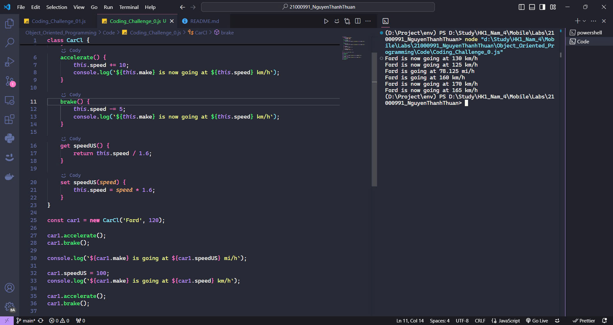
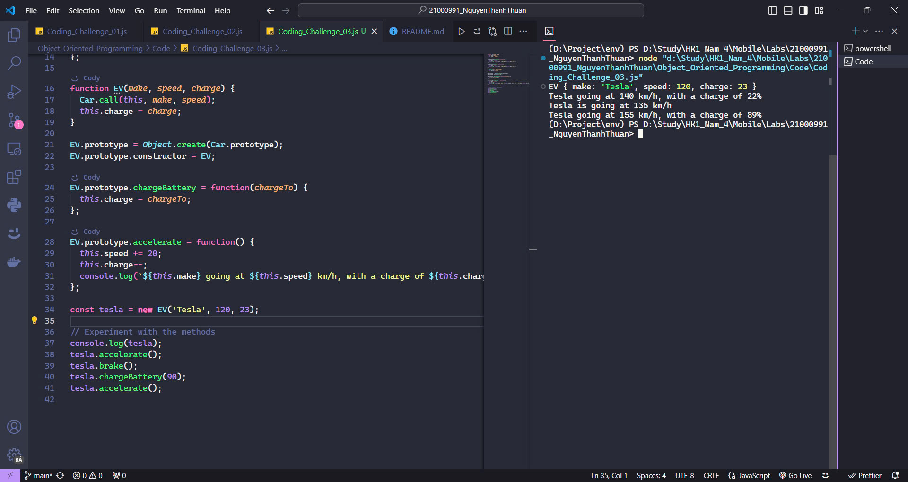
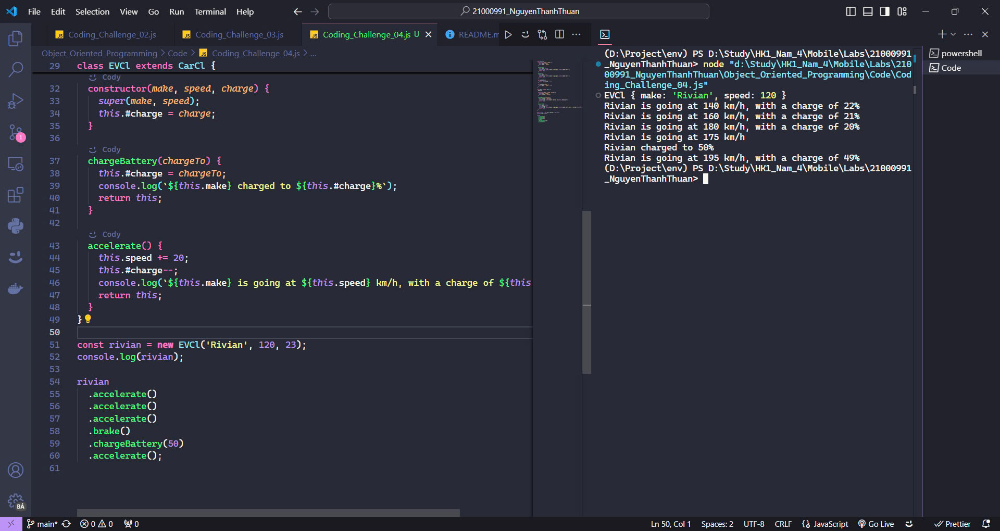
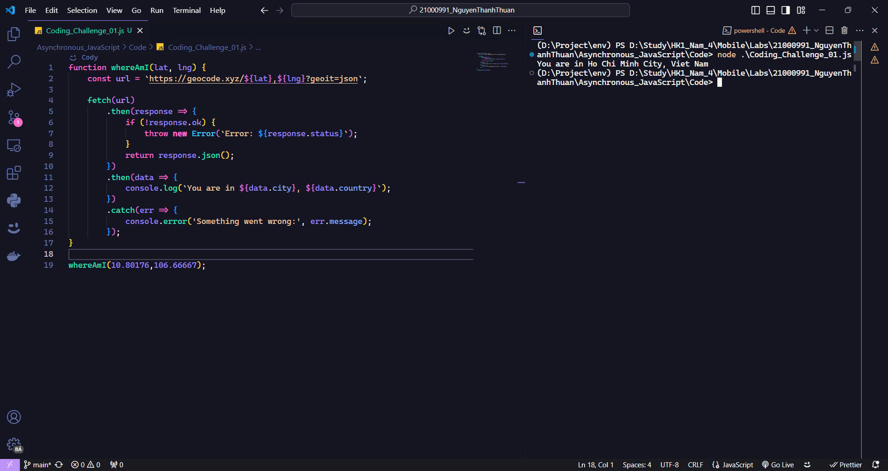
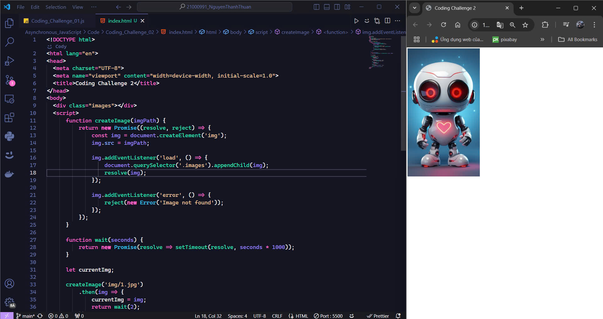
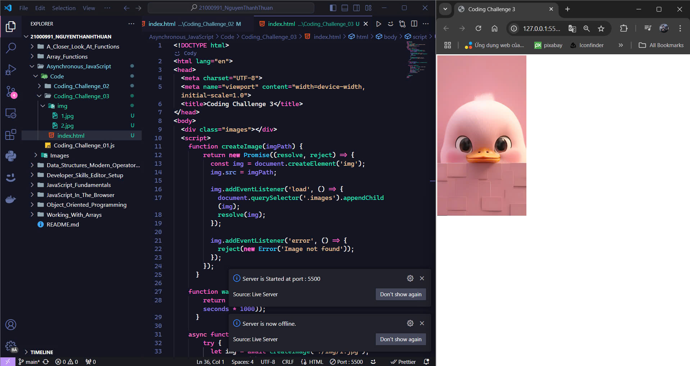
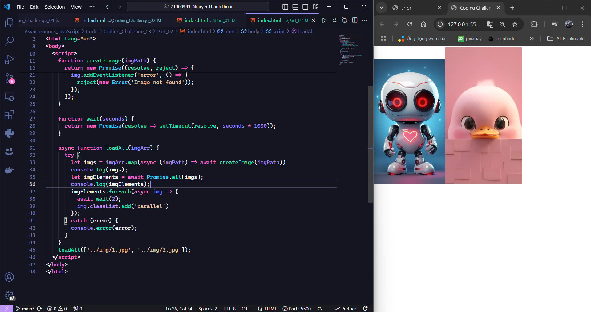
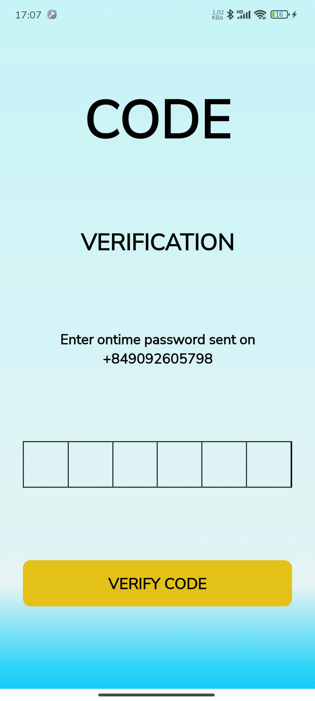
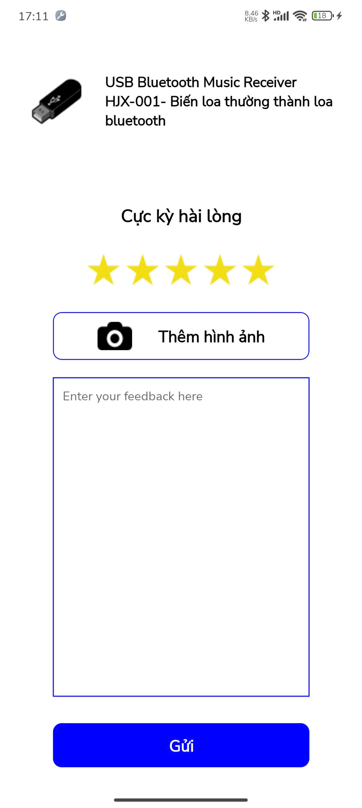
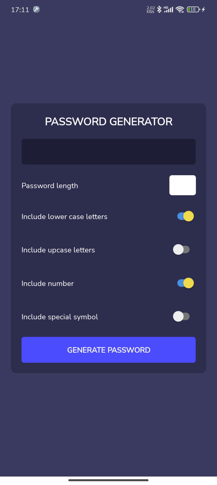

# JavaScript Course

## Table of Contents

- [JavaScript Fundamentals](#javascript-fundamentals)
  - [Part 1](#part-1)
  - [Part 2](#part-2)
- [Developer Skills & Editor Setup](#developer-skills--editor-setup)
- [JavaScript In The Browser](#javascript-in-the-browser)
- [Data Structures, Modern Operators, and Strings](#data-structures-modern-operators-and-strings)
- [A Closer Look at Functions](#a-closer-look-at-functions)
- [Working_With_Arrays](#working_with_arrays)
- [Opject Oriented Programming (OOP)](#opject-oriented-programming)
- [Asynchronous JavaScript](#asynchronous-javascript)
- [Lab 03](#lab-03)
- [Lab 04](#lab-04)
- [Lab 05](#lab-05)
- [Lab 06](#lab-06)
- [Lab 07](#lab-07)

## JavaScript Fundamentals

### Part 1

- [Coding Challenge 1](JavaScript_Fundamentals/Part_01/Code/Coding_Challenge_01.js)

  

- [Coding Challenge 2](JavaScript_Fundamentals/Part_01/Code/Coding_Challenge_02.js)

  

- [Coding Challenge 3](JavaScript_Fundamentals/Part_01/Code/Coding_Challenge_03.js)

  

- [Coding Challenge 4](JavaScript_Fundamentals/Part_01/Code/Coding_Challenge_04.js)

  

### Part 2

- [Coding Challenge 1](JavaScript_Fundamentals/Part_02/Code/Coding_Challenge_01.js)

  

- [Coding Challenge 2](JavaScript_Fundamentals/Part_02/Code/Coding_Challenge_02.js)

  

- [Coding Challenge 3](JavaScript_Fundamentals/Part_02/Code/Coding_Challenge_03.js)

  

- [Coding Challenge 4](JavaScript_Fundamentals/Part_02/Code/Coding_Challenge_04.js)

  

## Developer Skills & Editor Setup

- [Coding Challenge 1](Developer_Skills_Editor_Setup/Coding_Challenge_01.js)

  

## JavaScript In The Browser

- [Coding Challenge 1](JavaScript_In_The_Browser/Coding_Challenge_01.html)

  

## Data Structures, Modern Operators, and Strings

- [Coding Challenge 1](Data_Structures_Modern_Operators_And_Strings/Code/Coding_Challenge_01.js)

  

- [Coding Challenge 2](Data_Structures_Modern_Operators_And_Strings/Code/Coding_Challenge_02.js)

  

- [Coding Challenge 3](Data_Structures_Modern_Operators_And_Strings/Code/Coding_Challenge_03.js)

  

- [Coding Challenge 4](Data_Structures_Modern_Operators_And_Strings/Code/Coding_Challenge_04.html)

  

## A Closer Look at Functions

- [Coding Challenge 1](A_Closer_Look_At_Functions/Code/Coding_Challenge_01.html)

  

- [Coding Challenge 2](A_Closer_Look_At_Functions/Code/Coding_Challenge_02.html)

  

## Working With Arrays

- [Coding Challenge 1](Working_With_Arrays/Code/Coding_Challenge_01.js)

  

- [Coding Challenge 2](Working_With_Arrays/Code/Coding_Challenge_02.js)

  

- [Coding Challenge 3](Working_With_Arrays/Code/Coding_Challenge_03.js)

  

- [Coding Challenge 4](Working_With_Arrays/Code/Coding_Challenge_04.js)

  

## Opject Oriented Programming

- [Coding Challenge 1](Object_Oriented_Programming/Code/Coding_Challenge_01.js)

  

- [Coding Challenge 2](Object_Oriented_Programming/Code/Coding_Challenge_02.js)

  

- [Coding Challenge 3](Object_Oriented_Programming/Code/Coding_Challenge_03.js)

  

- [Coding Challenge 4](Object_Oriented_Programming/Code/Coding_Challenge_04.js)

  

## Asynchronous JavaScript

- [Coding Challenge 1](Asynchronous_JavaScript/Code/Coding_Challenge_01.js)
  
- [Coding Challenge 2](Asynchronous_JavaScript/Code/Coding_Challenge_02.js)
  
- [Coding Challenge 3 Part 01](Asynchronous_JavaScript/Code/Part_01/index.html)
  
- [Coding Challenge 3 Part 02](Asynchronous_JavaScript/Code/Part_02/index.html)
  

## Lab 03

- [App](Lab_03/ui/App.js)
- [Screen 01](Lab_03/ui/screen/Screen_01.js)
  
- [Screen 02](Lab_03/ui/screen/Screen_02.js)
  
- [Screen 03](Lab_03/ui/screen/Screen_03.js)
  
- [Screen 04](Lab_03/ui/screen/Screen_04.js)
  

## Lab 04

- [App](Lab_04/ui/App.js)
- [Screen 01](Lab_04/ui/screen/Screen_01.js)
  
- [Screen 02](Lab_04/ui/screen/Screen_02.js)
  
- [Screen 03](Lab_04/ui/screen/Screen_03.js)
  
- [Screen 04](Lab_04/ui/screen/Screen_04.js)
  

## Lab 05

- [App](Lab_05/ui/App.js)
- [Product](Lab_05/ui/screen/Product.js)
  
- [Product_Color](Lab_05/ui/screen/Product_Color.js)
  

## Lab 06

- [App](Lab_06/ui/App.js)
- [Screen 01](Lab_06/ui/screen/Screen_01.js)
  
- [Screen 02](Lab_06/ui/screen/Screen_02.js)
  

## Lab 07

- [App](Lab_07/ui/App.js)
- [Screen 01](Lab_07/ui/screen/Ex_01/Screen_01.js)
  
- [Screen 02](Lab_07/ui/screen/Ex_01/Screen_02.js)
  
- [Screen 03](Lab_07/ui/screen/Ex_01/Screen_03.js)
  

